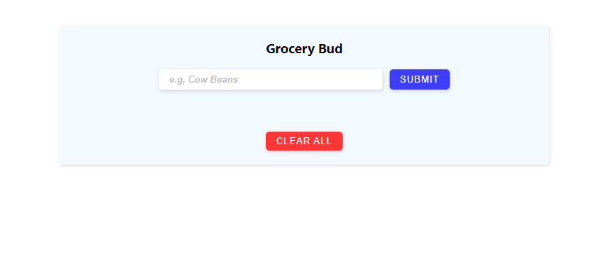
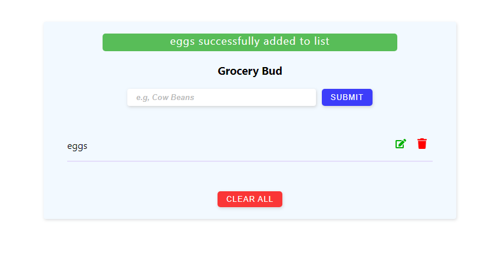
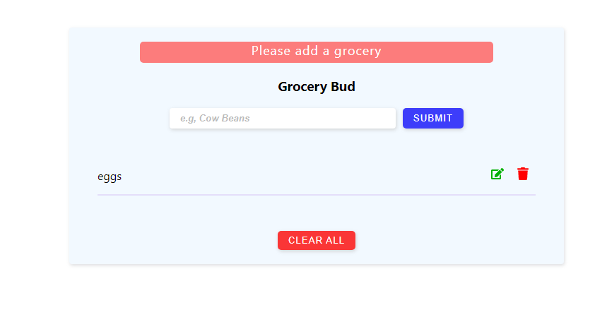
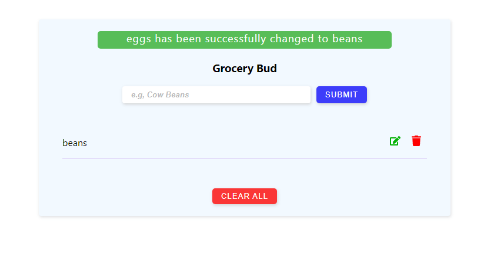
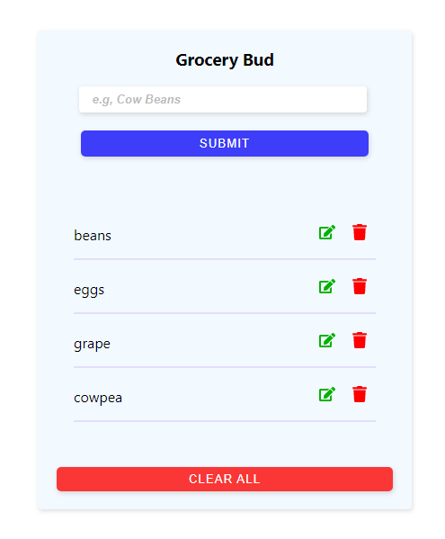

# Grocery-Bud

Completed the grocery bud web app using the react library, this is another
minor project completed in my quest of understanding the react library. In this 
project I was able to build a kind of todo list in form of a grocery list. that allows
one to add, delete, edit and clear the whole list. I also added an alert component
that rendder depending on what type of action is performed by the user. also the data are stored
locally on the user system and can be accessed even when the user refresh the page.

below are picture of what the Grocery Bud web app

